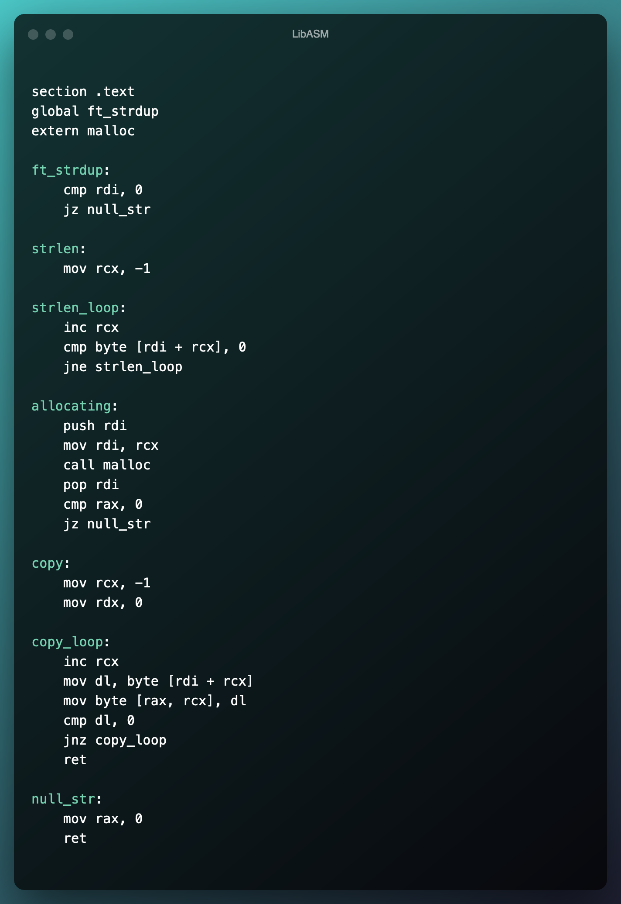

<h1 align="center">LibASM</h1>
<h3 align="center">A small asm library of usefull functions</h3>

 - Little preview

<h6>  Installation :</h6>

make

  
  
<h6> Usage :</h6>

   - you need to add those prototypes

size_t	ft_read(int fd, const void *buf, size_t nbyte);

int		ft_strcmp(const char *str1, const char *str2);

char	*ft_strcpy(char *dst, const char *src);

char	*ft_strdup(const char *src);

size_t	ft_strlen(const char *s);

size_t	ft_write(int fd, const void *buf, size_t nbyte);

- 🌱 Made at 42

